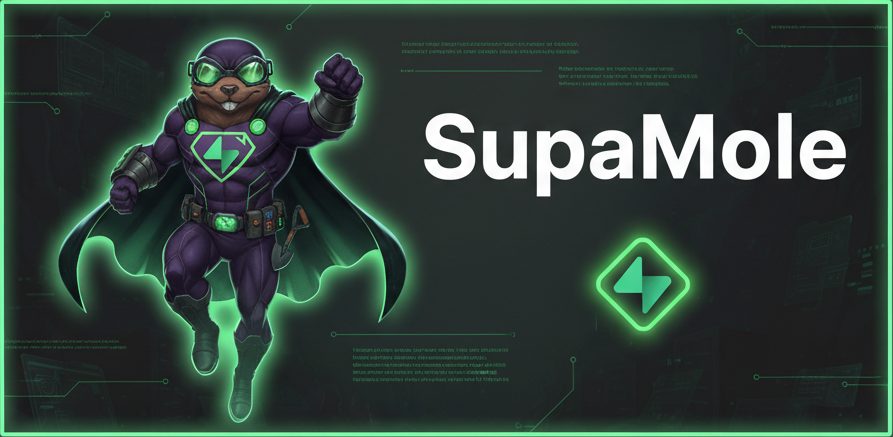

# Supamole — Supabase Security Scanner



An independent script and web app that uses the Supabase SDK to discover and extract data from all available objects in a Supabase instance. The web UI (Supamole) runs entirely in the browser for security, GDPR and data-leak checks.

## Project structure

- **CLI:** `extract-data.js` — Node script for automation/CI.
- **Web app (Supamole):** Vite-built static site:
  - `index.html` — Single-page app shell and styles.
  - `public/` — Entry `main.js`, app logic `app.js`, assets (logo, favicon, etc.).
- **Build:** `npm run dev` (Vite dev server), `npm run build` (output in `dist/`).

## Installation

```bash
npm install
```

## Usage

### Web interface (Supamole)

The scan runs entirely in the browser; no server is required and credentials are not stored.

**Development:**

```bash
npm run dev
```

Open the URL shown (e.g. `http://localhost:5173`), enter your Supabase URL and anon key (and optional auth), then run the scan.

**Production:**

```bash
npm run build
npx serve dist
```

Serve the `dist/` folder with any static file server.

### CLI (anonymous access)

```bash
node extract-data.js --url YOUR_SUPABASE_URL --key YOUR_ANON_KEY
```

### CLI with email/password authentication

```bash
node extract-data.js --url YOUR_SUPABASE_URL --key YOUR_ANON_KEY --email your@email.com --password yourpassword
```

### CLI with bearer token

```bash
node extract-data.js --url YOUR_SUPABASE_URL --key YOUR_ANON_KEY --token YOUR_BEARER_TOKEN
```

### Fast discovery (recommended for large databases)

```bash
node extract-data.js --url YOUR_SUPABASE_URL --key YOUR_ANON_KEY --fast-discovery
```

## Parameters

- `--url` (required): Your Supabase project URL
- `--key` (required): Your Supabase anon key
- `--email` (optional): Email for authentication
- `--password` (optional): Password for authentication
- `--token` (optional): Bearer token (JWT from Supabase Auth); overrides email/password if both are set
- `--fast-discovery` (optional): Skip comprehensive table name discovery for faster execution

## Features

### Advanced table discovery

The script uses multiple methods to discover tables across schemas:

- **information_schema.tables** / **pg_tables** — Public and auth schemas
- **RPC functions** — Custom stored procedures (if available)
- **information_schema.views** — Database views
- **Auth schema tables** — Known Supabase auth tables (auth.users, auth.sessions, etc.)
- **REST API introspection** — OpenAPI analysis
- **GraphQL introspection** — Types/tables via GraphQL endpoint
- **Common name discovery** — Tests many common table names (skippable with `--fast-discovery`)

### GraphQL schema discovery

- Introspects `/graphql/v1`, analyzes Query type and queryable object types
- Converts PascalCase types to snake_case for extraction
- Excludes scalars and pagination types

### Auth schema support

Tests and extracts (with sensitive masking where appropriate) from auth tables such as `auth.users`, `auth.sessions`, `auth.identities`, `auth.refresh_tokens`, `auth.audit_log_entries`, and others.

### Data extraction

- Lists discovered tables/views with types, column info, row counts
- Sample data (e.g. first rows), rate limiting, and error handling

### PII detection (GDPR)

- Scans columns and sample values for suspected PII (name, DoB, address, phone, etc.)
- Reports findings with examples for GDPR review; in the web UI, “Tables with suspected PII” summarizes these.

### Storage scan

- Lists Storage buckets and config (public/private, file size limit)
- Indexes objects (root and one level of subfolders) up to a cap
- For public buckets, checks whether sample object URLs are reachable without auth
- Results in CLI output and web UI under “Storage analysis”

### Authentication & security

- Anonymous, email/password, and bearer token auth
- Bearer token takes precedence when both token and email/password are provided
- No persistent storage of credentials; in the web app they are used only in memory for the run.

## License

This project is licensed under **CC BY-NC-SA 4.0** (Creative Commons Attribution-NonCommercial-ShareAlike 4.0). You may use, share, and adapt it for non-commercial purposes with attribution; derivatives must use the same license. See [LICENSE](LICENSE) and the [full legal code](https://creativecommons.org/licenses/by-nc-sa/4.0/legalcode).

## Credit

Created by [The Distance](https://thedistance.co.uk?utm_source=supamole&utm_medium=referral). Source: [TheDistanceHQ/supamole](https://github.com/TheDistanceHQ/supamole).
